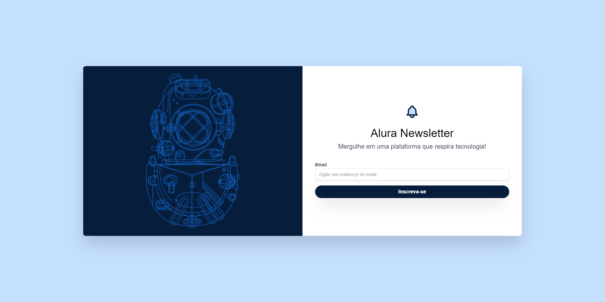

# Newsletter
 Site criado utilizando o Tailwind CSS

Projeto feito durante a aula na plataforma Alura, criado utilizando Tailwind CSS.

| :placard: Vitrine.Dev |     |
| -------------  | --- |
| :sparkles: Nome        | **Newsletter**
| :label: Tecnologias |Tailwind CSS
| :rocket: URL         | https://wave-cast-orcin.vercel.app/

<!-- Inserir imagem com a #vitrinedev ao final do link -->
